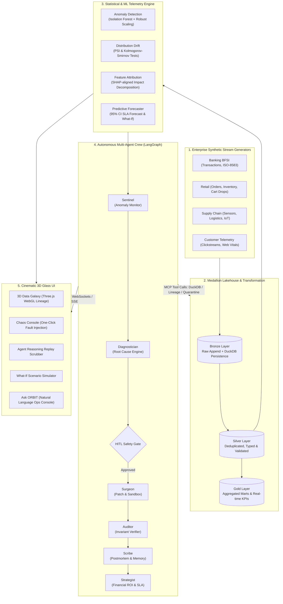

# ORBIT: Autonomous Data Operations Control Tower

[](https://opensource.org/licenses/Apache-2.0)
[](https://nextjs.org/)
[](https://fastapi.tiangolo.com/)
[](https://threejs.org/)
[](https://duckdb.org/)
[](https://langchain-ai.github.io/langgraph/)
[](https://www.docker.com/)
[](tests/test_smoke_e2e.py)

> **"Data that heals itself."**  
> **ORBIT** is a cinematic, portfolio-grade autonomous data operations control tower built for modern enterprise data platforms (BFSI, Retail, and Supply Chain). It fuses **3D WebGL spatial telemetry**, **autonomous multi-agent incident diagnosis and remediation**, **live chaos engineering**, and **statistical drift and anomaly detection** into an ultra-premium executive dashboard that feels like a Bloomberg terminal crossed with an Apple flagship product experience.

---

## 🏛️ System Architecture



---

## 🌟 The 5 Unique Hooks

### 1. 🌌 3D Data Galaxy (Spatial WebGL Lineage)
- **Interactive 3D Graph**: 18 orbital nodes spanning Ingestion, Bronze, Silver, Gold, ML Models, and Executive BI Dashboards.
- **Visual Health Pulses**: Failing or quarantined nodes pulse with emergency coral lighting (`#FF5A5F`) and emit orbital hazard rings.
- **Autonomous Agent Light Orbs**: Sentinel and Surgeon agents travel through pipeline edges as animated glowing orbs, demonstrating real-time healing traversals across graph dependencies.
- **Node Inspector Sheet**: Clicking any 3D node opens a slide-over panel displaying live schema attributes, row counts, P95 latency, freshness, and upstream/downstream impact graphs.

### 2. ⚡ Chaos Mode (One-Click Enterprise Fault Injection)
- **8+ Enterprise Disruption Types**:
  1. *Schema Drift*: Dynamic column addition/removal/type mutations.
  2. *Null Spikes*: Catastrophic null injections across critical fields (e.g., transaction amounts).
  3. *Late Arrivals*: Time-travel timestamps outside SLA ingestion windows.
  4. *Duplicate Storms*: Artificial idempotency failures and duplicate floods.
  5. *Distribution Drift*: Subtle statistical shifts in transaction sizes.
  6. *Extreme Outliers*: 10x-50x numeric anomalies.
  7. *Type Mismatch*: String-corrupted integers and malformed payloads.
  8. *Volume Collapses*: Upstream source dropouts.
- **Interactive Console**: Preset seedable scenarios or custom parameter configurations with real-time terminal audit logging.

### 3. ⏪ Agent Reasoning Replay Scrubber
- **Time-Travel Debugging**: Inspect the multi-agent cognitive trace across discrete cognitive steps:
  - `Sentinel`: Threshold breaches & statistical anomaly detection.
  - `Diagnostician`: DuckDB vector memory retrieval, query diffs & root-cause hypotheses.
  - `HITL Gate`: Human-in-the-loop automated/manual safety checkpoint.
  - `Surgeon`: Sandbox hot-patching, quarantine table creation, and schema migration.
  - `Auditor`: Automated invariant re-execution ensuring 100% data quality restoration.
  - `Scribe`: Human-readable executive incident report generation.
  - `Strategist`: Downstream business loss avoidance and MTTR impact calculation.
- **Interactive Scrubber**: Slider lets operators drag back and forth in time to watch each agent's internal thoughts, tool calls, and results.

### 4. 🎛️ What-If Simulator
- **Interactive Sliders**:
  - *Data Volume Multiplier* (0.5x to 5.0x)
  - *Fault Rate* (0.0% to 25.0%)
  - *Latency Budget* (100ms to 1000ms)
- **Non-Linear Projections**: Generates dual before-and-after latency curves, calculates SLA breach probabilities, projects Mean Time to Remediation (MTTR), and estimates hourly downtime risk cost ($ USD).

### 5. 💬 Ask ORBIT Console (Natural Language Ops Assistant)
- **Grounded Natural Language to SQL**: Converts operator prompts (e.g., *"Show bronze banking transactions"*, *"Why did revenue spike?"*) into syntactically valid DuckDB queries.
- **Live Analytical Execution**: Returns structured data tables and auto-configured charts directly from the embedded analytical lakehouse.
- **3D Lineage Spotlight**: Highlights the affected pipeline nodes and dependencies directly inside the 3D Data Galaxy.

---

## ⚡ Quickstart (Under 5 Commands)

### Option A: Complete Docker Compose Stack

```bash
# 1. Clone & enter workspace
git clone https://github.com/prathameshpatelmumbai/OrbitDataSciencePrj.git
cd OrbitDataSciencePrj

# 2. Copy environment variables
cp .env.example .env

# 3. Spin up full containerized stack
docker compose up -d

# 4. Access the Control Tower
# Web UI:       http://localhost:3000
# API Docs:     http://localhost:8000/docs
# MLflow:       http://localhost:5000
```

### Option B: Local Hybrid Development

#### 1. Backend (FastAPI + Embedded DuckDB + Multi-Agent Crew)
```bash
# Python 3.11+
python -m venv .venv
source .venv/bin/activate  # Or on Windows: .venv\Scripts\activate
pip install -r services/api/requirements.txt

# Start FastAPI server on port 8000
uvicorn services.api.app.main:app --reload --port 8000
```

#### 2. Frontend (Next.js 14 App Router + Three.js)
```bash
cd apps/web
npm install
npm run dev
# Open http://localhost:3000 in your browser
```

---

## 🧪 Comprehensive Verification & Test Suite

The repository includes a complete suite of **41 unit, integration, and end-to-end smoke tests**:

```bash
# Run the complete test suite
python -m pytest data-gen/tests pipelines/tests ml/tests agents/tests services/api/tests tests/test_smoke_e2e.py -v
```

### Test Coverage Highlights:
- **`data-gen/tests`**: Synthetic batch generation across 4 enterprise domains and 8 fault injection types.
- **`pipelines/tests`**: Medallion pipeline transformations, dbt models, and Great-Expectations-style invariant validations.
- **`ml/tests`**: Isolation Forest anomaly scoring, PSI $[-\infty, +\infty]$ drift computation, KS tests, and SLA forecasting.
- **`agents/tests`**: Tool registry (`run_sql`, `quarantine_batch`, `get_lineage`), pgvector memory similarity, and 6-agent LangGraph workflow.
- **`services/api/tests`**: REST endpoints (`/pipelines`, `/lineage`, `/incidents`, `/chaos`, `/ask`, `/simulate`, `/metrics`) and WebSocket streaming bus.
- **`tests/test_smoke_e2e.py`**: Full lifecycle validation from stream generation $\to$ fault injection $\to$ quality invariant breach $\to$ multi-agent autonomous remediation $\to$ API verification.

---

## 🚀 Production Deployment Guide

### Frontend Deployment (Vercel)
The web application is built with the Next.js 14 App Router and is fully optimized for Vercel:

1. Push your repository to GitHub.
2. In the Vercel Dashboard, import the repository and set the **Root Directory** to `apps/web`.
3. Set the Environment Variables:
   - `NEXT_PUBLIC_API_URL`: Your deployed backend URL (e.g., `https://orbit-api.up.railway.app`).
   - `NEXT_PUBLIC_WS_URL`: Your deployed WebSocket URL (e.g., `wss://orbit-api.up.railway.app/ws/events`).
4. Click **Deploy**. The build command is `npm run build` with zero external dependencies needed.

### Backend Deployment (Railway / Render / Fly.io / AWS ECS)
The backend container is specified in `infra/Dockerfile.api`:

```bash
# Build the production container
docker build -f infra/Dockerfile.api -t orbit-api:latest .

# Run with persistent volume for DuckDB storage
docker run -p 8000:8000 -v $(pwd)/storage:/app/storage orbit-api:latest
```

---

## 📂 Repository Directory Layout

```
OrbitDataSciencePrj/
├── apps/
│   └── web/                   # Next.js 14 App Router, Three.js/R3F, Tailwind, Recharts
│       ├── app/               # Page routes & layout
│       ├── components/        # 3D Galaxy, Chaos Console, Agent Crew, Replay, Simulator
│       └── lib/               # Typed API client, offline fallbacks, Three.js utils
├── services/
│   └── api/                   # FastAPI async backend + WebSocket bus
│       ├── app/routers/       # Endpoints: pipelines, lineage, incidents, chaos, ask, simulate
│       └── app/services/      # Incident orchestrator & Ask ORBIT NL-to-SQL service
├── pipelines/
│   ├── dagster_project/       # Dagster software-defined assets
│   ├── dbt_project/           # Medallion transformations (Bronze -> Silver -> Gold)
│   ├── data_quality/          # Declarative invariant & expectation suites
│   └── pipeline_runner.py     # 18-node spatial lineage execution engine
├── agents/                    # Multi-Agent LangGraph Crew
│   ├── crew.py                # Sentinel -> Diagnostician -> Surgeon -> Auditor -> Scribe -> Strategist
│   ├── tools.py               # Enterprise tool library (DuckDB, lineage, quarantine, metrics)
│   ├── mcp_server.py          # Model Context Protocol (MCP) server & tool dispatch
│   └── memory.py              # pgvector semantic incident memory
├── ml/                        # ML & Statistical Telemetry
│   ├── anomaly_detector.py    # Isolation Forest with dynamic contamination & robust scaling
│   ├── drift_detector.py      # Population Stability Index (PSI) & Kolmogorov-Smirnov tests
│   ├── explainability.py      # SHAP-aligned feature attribution decomposition
│   └── forecaster.py          # Predictive SLA forecaster & What-If simulator
├── data-gen/                  # Enterprise Synthetic Stream Generator
│   ├── streams/               # BFSI, Retail, Supply Chain, Customer streams
│   ├── fault_injector.py      # 8+ chaos fault injection engines
│   └── storage_manager.py     # Embedded DuckDB storage & Parquet partitioner
├── tests/
│   └── test_smoke_e2e.py      # End-to-end integration smoke test
├── infra/                     # Dockerfiles & PostgreSQL + pgvector init scripts
├── docs/                      # Architecture blueprints & design rationale
├── docker-compose.yml         # Unified container orchestration
└── README.md                  # Control Tower Documentation
```

---

## 🛡️ License
Distributed under the Apache 2.0 License. See `LICENSE` for details.
