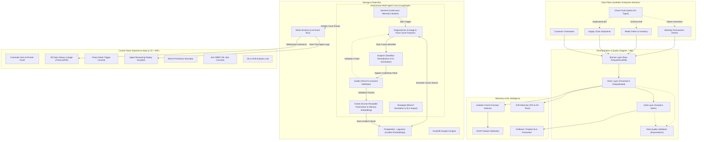

# ORBIT System Architecture

```mermaid
flowchart TB
    subgraph DataPlane["Data Plane (Synthetic Enterprise Streams)"]
        BFSI["Banking Transactions Stream"]
        Retail["Retail Orders & Inventory"]
        Supply["Supply Chain Shipments"]
        Events["Customer Clickstream"]
        FaultGen["Chaos Fault Injector (8+ Types)"]
        
        FaultGen -.->|Injects Anomalies| BFSI
        FaultGen -.->|Schema Drift| Retail
        FaultGen -.->|Duplicates/Late| Supply
    end

    subgraph PipelinePlane["Transformation & Quality (Dagster + dbt)"]
        Bronze["Bronze Layer (Raw Parquet/DuckDB)"]
        Silver["Silver Layer (Cleansed & Deduplicated)"]
        Gold["Gold Layer (Analytics Marts)"]
        GE["Data Quality Validation (Expectations)"]

        BFSI --> Bronze
        Retail --> Bronze
        Supply --> Bronze
        Events --> Bronze

        Bronze --> Silver
        Silver --> Gold
        Silver -.-> GE
        Gold -.-> GE
    end

    subgraph MLPlane["Telemetry & ML Intelligence"]
        IForest["Isolation Forest Anomaly Detector"]
        Evidently["Drift Detection (PSI & KS Tests)"]
        SHAP["SHAP Feature Attribution"]
        Forecaster["XGBoost / Prophet SLA Forecaster"]

        Silver --> IForest
        Silver --> Evidently
        IForest --> SHAP
        Gold --> Forecaster
    end

    subgraph AgenticPlane["Autonomous Multi-Agent Crew (LangGraph)"]
        Sentinel["Sentinel (Continuous Telemetry Monitor)"]
        Diagnostician["Diagnostician (Lineage & Root Cause Analysis)"]
        Surgeon["Surgeon (Sandbox Remediation & Fix Generation)"]
        Auditor["Auditor (Post-Fix Invariant Validation)"]
        Scribe["Scribe (Human-Readable Postmortem & Memory Embedding)"]
        Strategist["Strategist (What-If Simulation & SLA Impact)"]

        Sentinel -->|Alert Trigger| Diagnostician
        Diagnostician -->|Root Cause Identified| Surgeon
        Surgeon -->|Applies Code/Data Patch| Auditor
        Auditor -->|Validation Passed| Scribe
        Auditor -.->|Validation Failed| Diagnostician
    end

    subgraph MemoryStorage["Storage & State Bus"]
        PG["PostgreSQL + pgvector (Incident Embeddings)"]
        RedisBus["Redis Streams (Live Event Bus)"]
        DuckEngine["DuckDB Analytics Engine"]
        
        Diagnostician <-->|Semantic Vector Search| PG
        Scribe -->|Store Incident Vector| PG
        AgenticPlane -->|Publish Trace Events| RedisBus
    end

    subgraph PresentationPlane["Control Tower Experience (Next.js 15 + R3F)"]
        Hero["Cinematic Hero & Pinned Scroll"]
        ThreeGalaxy["3D Data Galaxy Lineage (Three.js/R3F)"]
        ChaosConsole["Chaos Mode Trigger Console"]
        ReplayScrubber["Agent Reasoning Replay Scrubber"]
        WhatIf["What-If Predictive Simulator"]
        AskConsole["Ask ORBIT (NL Ops Console)"]
        Insights["ML & Drift Analytics Lab"]
        
        RedisBus -->|WebSocket /ws/events| ThreeGalaxy
        RedisBus -->|Real-Time Agent Logs| ReplayScrubber
    end
```
